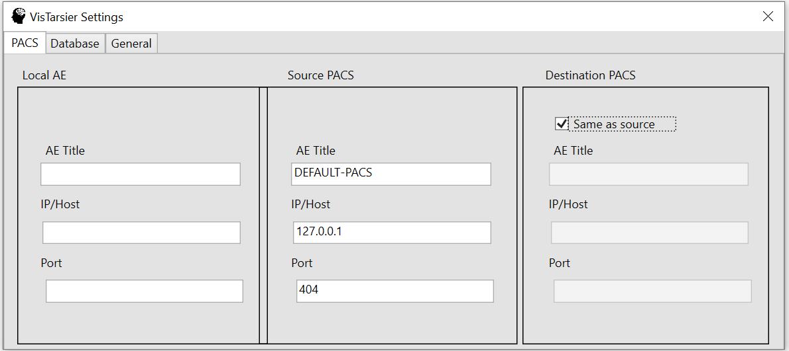
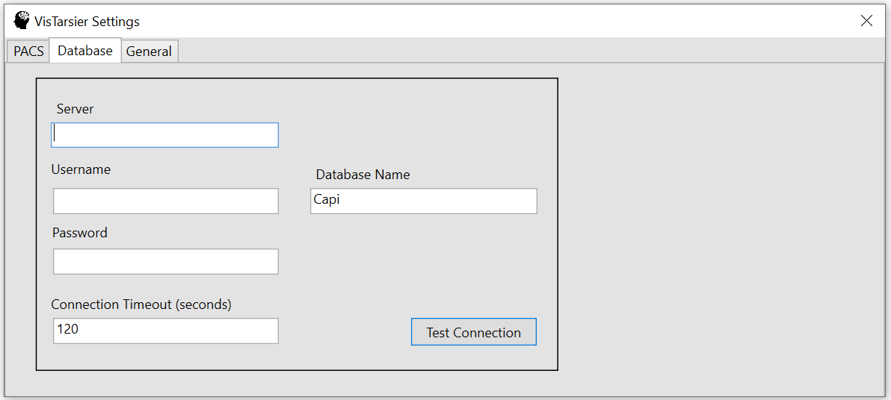
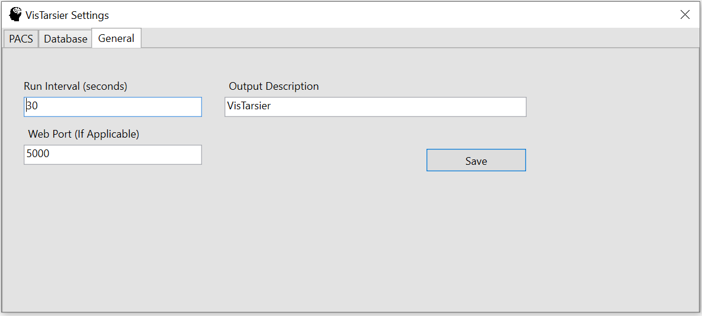

# Getting started
# Running the Docker Image
This is probably the fastest way to test VisTarsier (if you already have Docker and a pair of Nifti files to compare).

To build the docker image, use the Dockerfile in vistarsier/vtdocker.

Or you can run the current build from dockerhub by typing:
`docker run --rm plwp/vistarsier [prior.nii] [current.nii]`

# Installing the full service version
## Who is this for?
The full version of VisTarsier is designed to be integrated into a hospital research setting. The package is designed to send and receive images from a PACS.

## Before you start...

## System Environment
### The VisTarsier Machine
The VisTarsier service is built for Microsoft .NET Framework 4.6.1 and requires Microsoft Windows 7 64bit or later. 

We would recommend dedicating at least 8GB of RAM and 120GB of disk space to any machine running VisTarsier. The software is largely CPU bound and will scale well up to 8 cores.

## Pre-requisites
### Database
The VisTarsier service uses [Microsoft SQL Server](https://www.microsoft.com/en-gb/sql-server/sql-server-downloads) to store its state. This will need to be installed somewhere on the network. It can be installed on the same box as VisTarsier and the Express edition should be sufficient. If you have a requirement for using a different SQL implementation let us know.

## RIS/HL7
The VisTarsier service doesn’t directly integrate an HL7 messaging channel so RIS integration will need to be setup separately. By default the service just polls the hl7 and manual folders for new accession files.

We recommend installing [NextGen Connect](https://github.com/nextgenhealthcare/connect) on your VisTarsier box, and importing the [provided channel]( https://github.com/mh-cad/vistarsier/blob/master/Integration/mirth_channel.xml) as a starting point. You will need to set the <VT Install Path> values in the triggered script.

Once you have the channel setup you will need to talk to your RIS team to have new messages sent to the channel.

## PACS
VisTarsier uses the DICOM commands C_FIND, C_MOVE and C_STORE to interact with the PACS. You will need the IP Address of your VisTarsier box along with the AE Title (this can be set in the config, but the default is VT). By default, VT uses port 4104 for DICOM messaging. Talk to your PACS team or vendor to setup the appropriate permissions. This will include the IP or hostname of your VT box.

## Installing
To install VisTarsier, we recommend using the compiled installer which can be found in the [releases](https://github.com/mh-cad/vistarsier/releases) section of the GitHub.

You’ll need your SQL database and PACS details handy for configuration, but the process should otherwise act like a standard installer.

There is an option to install VisTarsier Web services. This will publish a web-interface on port 5000 which will allow you do see the current Jobs and Log file, as well as create manual attempts. 

If you encounter a write error while installing, you may need to stop or uninstall any existing instance of VT.

### Configuration

**PACS Settings** are displayed on the first page. You'll need the AE Title, hostname for your source and destination PACS systems. You'll also need VT's settings as setup in your PACS.
Note: VT is only a PACS client and can't be sent images directly (or respond to CECHO requests). It will query the source PACS based on accession numbers.


**Database Settings** contains the settings for your SQL database. If you don't have an SQL server you can use SQL Express. (Other implementations such as PostgresSQL and MySQL are not currently supported).
Make sure to test the connection to make sure everything's working before continuing.


**General Settings** contains the last few settings which aren't covered in the previous screens. Use the save and exit button to write your initial configuration files.
If you make a mistake you can run the application in ./service/VisTarsier.ConfigApp.exe again, or edit your config file directly.

## VisTarsier Automated Workflow
- The VisTarsier service will monitor the ./cases/hl7 and ./cases/manual for files which are named with accession numbers. These files can be either empty or contain a valid json recipe (and end in .json).
- Once a file is detected, it will be added to the Attempts table and the file will be removed.
- For each attempt, VisTarsier will try to match the current accession to a recipe, find a prior study for comparison, and download the DICOM files for both studies.
- If this is successful, an entry will be added to the Jobs table.
- Next, metadata slides will be added to the Destination PACS to show that the job is processing.
- Once the Job is processed the results will be uploaded along with a final metadata slide that shows the result of the Job.

How you integrate this into your systems is up to you, however a single instance is simpler (every deployment will need its own SCP setup in PACS to avoid CSTORE requests being sent to the wrong machine).


## Troubleshooting
We will add common issues and solutions to this section as they come up, but for now your best bet is to contact vistarsier-at-gmail-dot-com and we will try to help with any issues that come up. This will also help us improve the software.

### The database was not created during installation. 
This problem may result in a log entry such as:
```
INFO - Cleaning DB...
FATAL - Invalid object name 'Attempts'
```

Work around:
The database can be manually created using the appropriate script for you version in the Documentation/troubleshooting folder of this repo.
You will also need to add a default recipe to the StoredRecipes table.
The default values are:

Id = 1,
UserEditable = false,
Name = "MS Lesion Compare",
RecipeString = <the contents of ./cfg/defaultrecipe.json>


# Installing the command line tool
## Who is this for?
The command-line tool is for anyone who just needs the core functionality of VisTarsier for either research or testing and validation purposes, or to integrate VisTarsier into their custom workflow.

## System Environment
The VisTarsier CL tool is a [.NET Core]( https://dotnet.microsoft.com/download) application, however it includes Windows 64bit binaries, so it’s recommended that you use a Windows 7 or higher 64bit system.

## Prerequisites
VisTarsier CL requires [.NET Core]( https://dotnet.microsoft.com/download)

## Installing
The latest version of VisTarsier CL can be found in our GitHub [releases](https://github.com/mh-cad/vistarsier/releases).

To use the command line application, unzip the release and run the command

`dotnet VisTarsier.CommandLineTool.dll [prior.nii] [current.nii]`

Where prior.nii and current.nii are your prior and current NIfTI files.

## Troubleshooting
We will add common issues and solutions to this section as they come up, but for now your best bet is to constact vistarsier-at-gmail-dot-com and we will try to help with any issues that come up. This will also help us improve the software.


